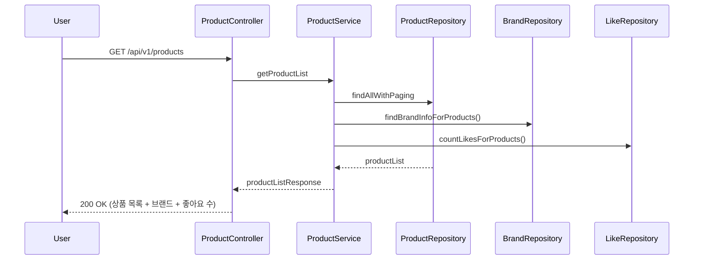
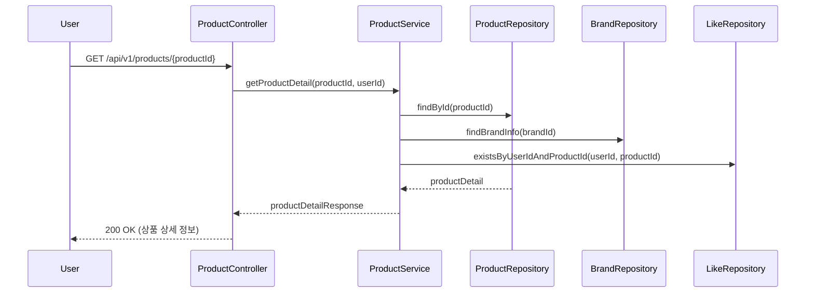
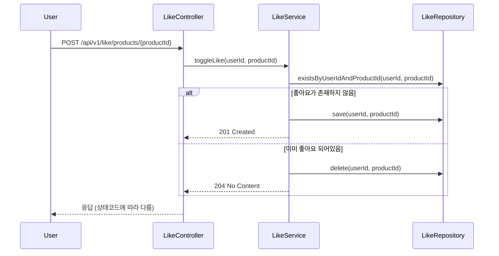
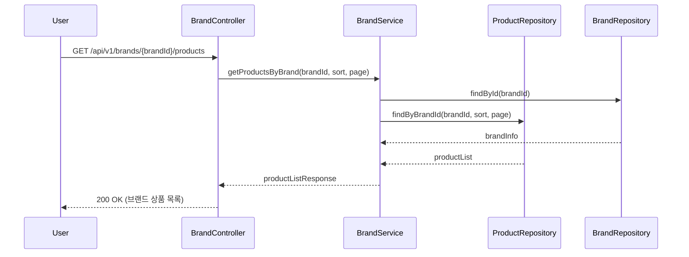
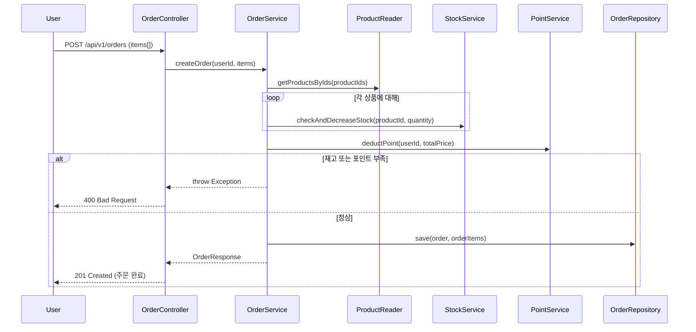
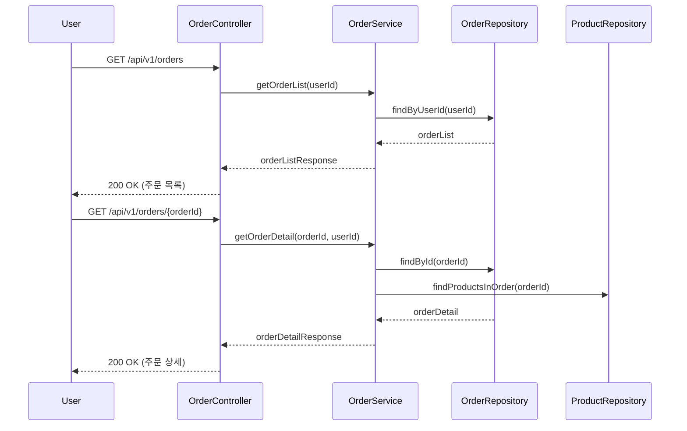
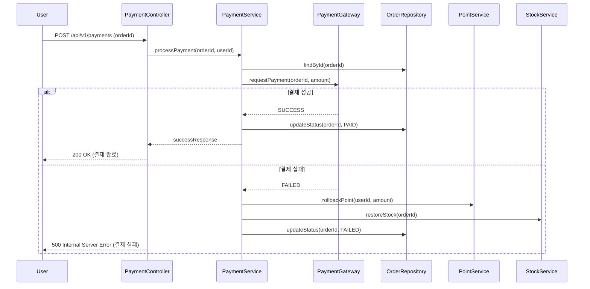

# 시퀀스 다이어그램

### 1. 상품 목록 조회

```mermaid
sequenceDiagram
    participant User
    participant ProductController
    participant ProductService
    participant ProductRepository
    participant BrandRepository
    participant LikeRepository

    User->>ProductController: GET /api/v1/products
    ProductController->>ProductService: getProductList
    ProductService->>ProductRepository: findAllWithPaging
    ProductService->>BrandRepository: findBrandInfoForProducts()
    ProductService->>LikeRepository: countLikesForProducts()
    ProductRepository-->>ProductService: productList
    ProductService-->>ProductController: productListResponse
    ProductController-->>User: 200 OK (상품 목록 + 브랜드 + 좋아요 수)
```
---
### 2. 상품 상세 조회

```mermaid
sequenceDiagram
    participant User
    participant ProductController
    participant ProductService
    participant ProductRepository
    participant BrandRepository
    participant LikeRepository

    User->>ProductController: GET /api/v1/products/{productId}
    ProductController->>ProductService: getProductDetail(productId, userId)
    ProductService->>ProductRepository: findById(productId)
    ProductService->>BrandRepository: findBrandInfo(brandId)
    ProductService->>LikeRepository: existsByUserIdAndProductId(userId, productId)
    ProductRepository-->>ProductService: productDetail
    ProductService-->>ProductController: productDetailResponse
    ProductController-->>User: 200 OK (상품 상세 정보)
```
---
### 3. 상품 좋아요 등록/취소

```mermaid
sequenceDiagram
    participant User
    participant LikeController
    participant LikeService
    participant LikeRepository

    User->>LikeController: POST /api/v1/like/products/{productId}
    LikeController->>LikeService: toggleLike(userId, productId)
    LikeService->>LikeRepository: existsByUserIdAndProductId(userId, productId)
    alt 좋아요가 존재하지 않음
        LikeService->>LikeRepository: save(userId, productId)
        LikeService-->>LikeController: 201 Created
    else 이미 좋아요 되어있음
        LikeService->>LikeRepository: delete(userId, productId)
        LikeService-->>LikeController: 204 No Content
    end
    LikeController-->>User: 응답 (상태코드에 따라 다름)
```
---

### 4. 브랜드별 상품 조회

```mermaid
sequenceDiagram
    participant User
    participant BrandController
    participant BrandService
    participant ProductRepository
    participant BrandRepository

    User->>BrandController: GET /api/v1/brands/{brandId}/products
    BrandController->>BrandService: getProductsByBrand(brandId, sort, page)
    BrandService->>BrandRepository: findById(brandId)
    BrandService->>ProductRepository: findByBrandId(brandId, sort, page)
    BrandRepository-->>BrandService: brandInfo
    ProductRepository-->>BrandService: productList
    BrandService-->>BrandController: productListResponse
    BrandController-->>User: 200 OK (브랜드 상품 목록)
```
---
### 5. 주문 생성

```mermaid
sequenceDiagram
    participant User
    participant OrderController
    participant OrderService
    participant ProductReader
    participant StockService
    participant PointService
    participant OrderRepository

    User->>OrderController: POST /api/v1/orders (items[])
    OrderController->>OrderService: createOrder(userId, items)
    OrderService->>ProductReader: getProductsByIds(productIds)
    loop 각 상품에 대해
        OrderService->>StockService: checkAndDecreaseStock(productId, quantity)
    end
    OrderService->>PointService: deductPoint(userId, totalPrice)
    alt 재고 또는 포인트 부족
        OrderService-->>OrderController: throw Exception
        OrderController-->>User: 400 Bad Request
    else 정상
        OrderService->>OrderRepository: save(order, orderItems)
        OrderService-->>OrderController: OrderResponse
        OrderController-->>User: 201 Created (주문 완료)
    end
```
---
### 6. 주문 목록 및 상세 조회

```mermaid
sequenceDiagram
    participant User
    participant OrderController
    participant OrderService
    participant OrderRepository
    participant ProductRepository

    User->>OrderController: GET /api/v1/orders
    OrderController->>OrderService: getOrderList(userId)
    OrderService->>OrderRepository: findByUserId(userId)
    OrderRepository-->>OrderService: orderList
    OrderService-->>OrderController: orderListResponse
    OrderController-->>User: 200 OK (주문 목록)

    User->>OrderController: GET /api/v1/orders/{orderId}
    OrderController->>OrderService: getOrderDetail(orderId, userId)
    OrderService->>OrderRepository: findById(orderId)
    OrderService->>ProductRepository: findProductsInOrder(orderId)
    OrderRepository-->>OrderService: orderDetail
    OrderService-->>OrderController: orderDetailResponse
    OrderController-->>User: 200 OK (주문 상세)
```
---
### 7. 결제 처리

```mermaid
sequenceDiagram
    participant User
    participant PaymentController
    participant PaymentService
    participant PaymentGateway
    participant OrderRepository
    participant PointService
    participant StockService

    User->>PaymentController: POST /api/v1/payments (orderId)
    PaymentController->>PaymentService: processPayment(orderId, userId)
    PaymentService->>OrderRepository: findById(orderId)
    PaymentService->>PaymentGateway: requestPayment(orderId, amount)
    alt 결제 성공
        PaymentGateway-->>PaymentService: SUCCESS
        PaymentService->>OrderRepository: updateStatus(orderId, PAID)
        PaymentService-->>PaymentController: successResponse
        PaymentController-->>User: 200 OK (결제 완료)
    else 결제 실패
        PaymentGateway-->>PaymentService: FAILED
        PaymentService->>PointService: rollbackPoint(userId, amount)
        PaymentService->>StockService: restoreStock(orderId)
        PaymentService->>OrderRepository: updateStatus(orderId, FAILED)
        PaymentController-->>User: 500 Internal Server Error (결제 실패)
    end
```
