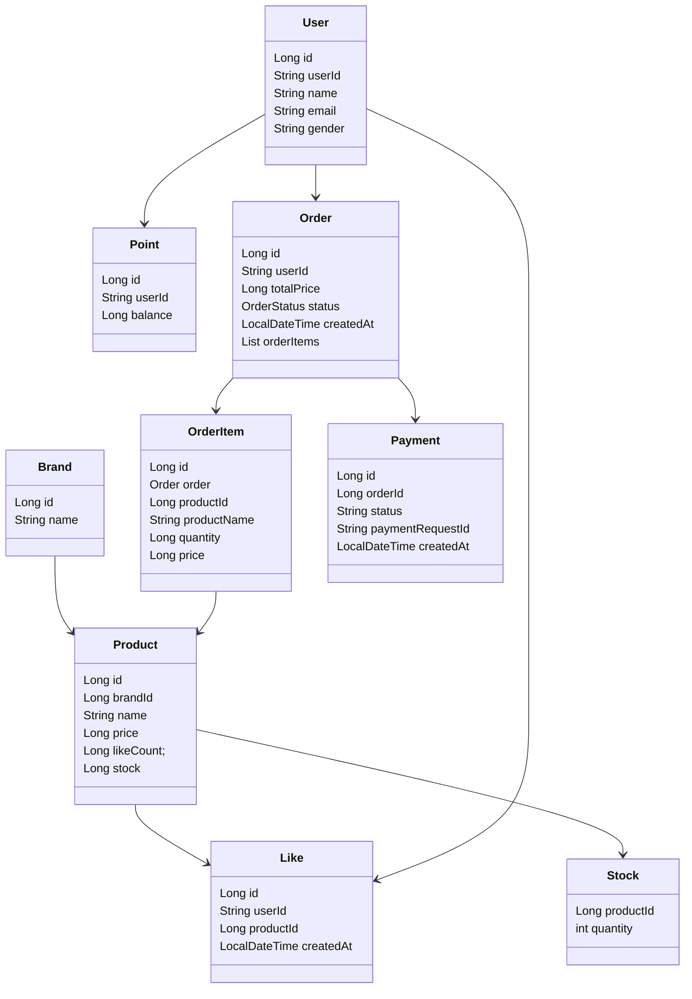

# 클래스 다이어그램

```mermaid
classDiagram
direction TB

class User {
  Long id
  String userId
  String name
  String email
  String gender
}

class Point {
  Long id
  String userId
  Long balance
}

class Brand {
  Long id
  String name
}

class Product {
  Long id
  Long brandId
  String name
  Long price
  Long likeCount;
  Long stock
}

class Stock {
  Long productId
  int quantity
}

class Like {
  Long id
  String userId
  Long productId
  LocalDateTime createdAt
}

class Order {
  Long id
  String userId
  Long totalPrice
  OrderStatus status
  LocalDateTime createdAt
  List<OrderItem> orderItems
}

class OrderItem {
  Long id
  Order order
  Long productId
  String productName
  Long quantity
  Long price
}

class Payment {
  Long id
  Long orderId
  String status
  String paymentRequestId
  LocalDateTime createdAt
}

%% 관계 설정
User --> Point
Brand --> Product
Product --> Stock
Product --> Like
User --> Like 
User --> Order 
Order --> OrderItem 
Order --> Payment 
OrderItem --> Product

```