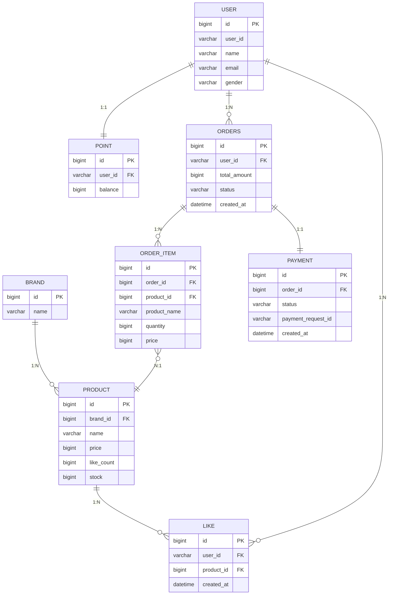

# erd

```mermaid
erDiagram
    USER {
        bigint id PK
        varchar user_id
        varchar name
        varchar email
        varchar gender
    }

    POINT {
        bigint id PK
        varchar user_id FK
        bigint balance
    }

    BRAND {
        bigint id PK
        varchar name
    }

    PRODUCT {
        bigint id PK
        bigint brand_id FK
        varchar name
        bigint price
        bigint like_count
        bigint stock
    }

    LIKE {
        bigint id PK
        varchar user_id FK
        bigint product_id FK
        datetime created_at
    }

    ORDERS {
        bigint id PK
        varchar user_id FK
        bigint total_amount
        varchar status
        datetime created_at
    }

    ORDER_ITEM {
        bigint id PK
        bigint order_id FK
        bigint product_id FK
        varchar product_name
        bigint quantity
        bigint price
    }

    PAYMENT {
        bigint id PK
        bigint order_id FK
        varchar status
        varchar payment_request_id
        datetime created_at
    }

    %% 관계 (cardinality)
    USER ||--|| POINT : "1:1"
    BRAND ||--o{ PRODUCT : "1:N"
    PRODUCT ||--o{ LIKE : "1:N"
    USER ||--o{ LIKE : "1:N"
    USER ||--o{ ORDERS : "1:N"
    ORDERS ||--o{ ORDER_ITEM : "1:N"
    ORDER_ITEM }o--|| PRODUCT : "N:1"
    ORDERS ||--|| PAYMENT : "1:1"
```