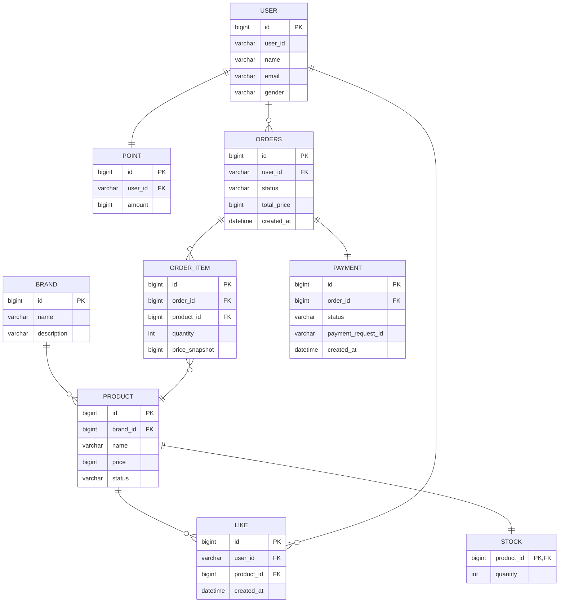

# 엔티티 다이어그램

```mermaid
erDiagram
    USER {
        bigint id PK
        varchar user_id
        varchar name
        varchar email
        varchar gender
    }

    POINT {
        bigint id PK
        varchar user_id FK
        bigint amount
    }

    BRAND {
        bigint id PK
        varchar name
        varchar description
    }

    PRODUCT {
        bigint id PK
        bigint brand_id FK
        varchar name
        bigint price
        varchar status
    }

    STOCK {
        bigint product_id PK, FK
        int quantity
    }

    LIKE {
        bigint id PK
        varchar user_id FK
        bigint product_id FK
        datetime created_at
    }

    ORDERS {
        bigint id PK
        varchar user_id FK
        varchar status
        bigint total_price
        datetime created_at
    }

    ORDER_ITEM {
        bigint id PK
        bigint order_id FK
        bigint product_id FK
        int quantity
        bigint price_snapshot
    }

    PAYMENT {
        bigint id PK
        bigint order_id FK
        varchar status
        varchar payment_request_id
        datetime created_at
    }

    %% 관계 설정 (한글 버전)
    USER ||--|| POINT : ""
    BRAND ||--o{ PRODUCT : ""
    PRODUCT ||--|| STOCK : ""
    PRODUCT ||--o{ LIKE : ""
    USER ||--o{ LIKE : ""
    USER ||--o{ ORDERS : ""
    ORDERS ||--o{ ORDER_ITEM : ""
    ORDERS ||--|| PAYMENT : ""
    ORDER_ITEM }o--|| PRODUCT : ""

```