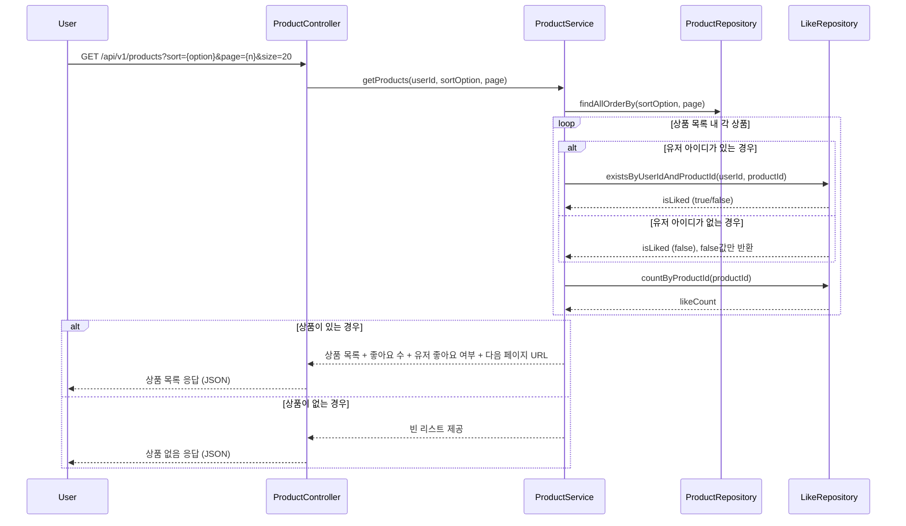
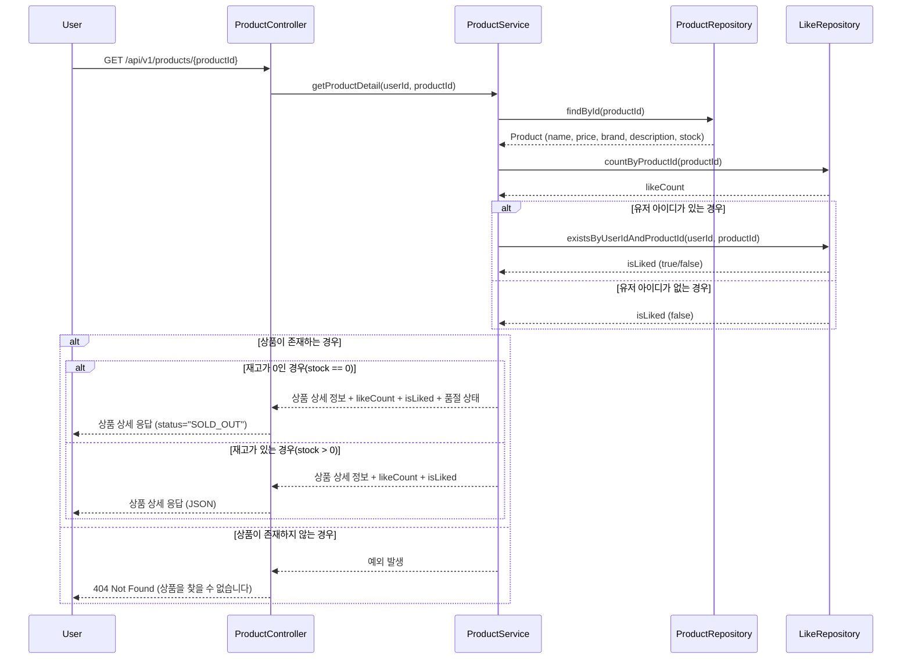
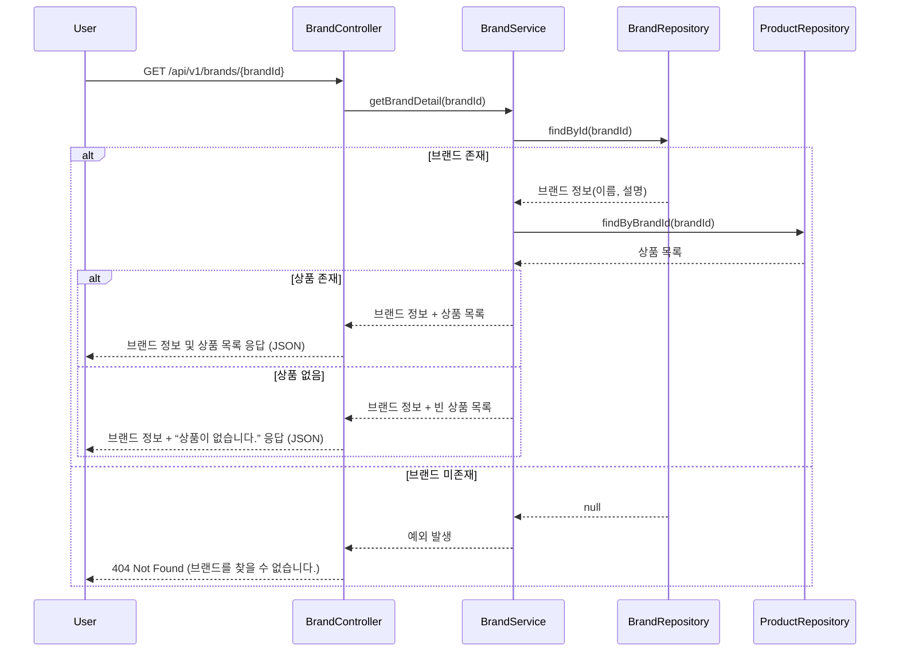
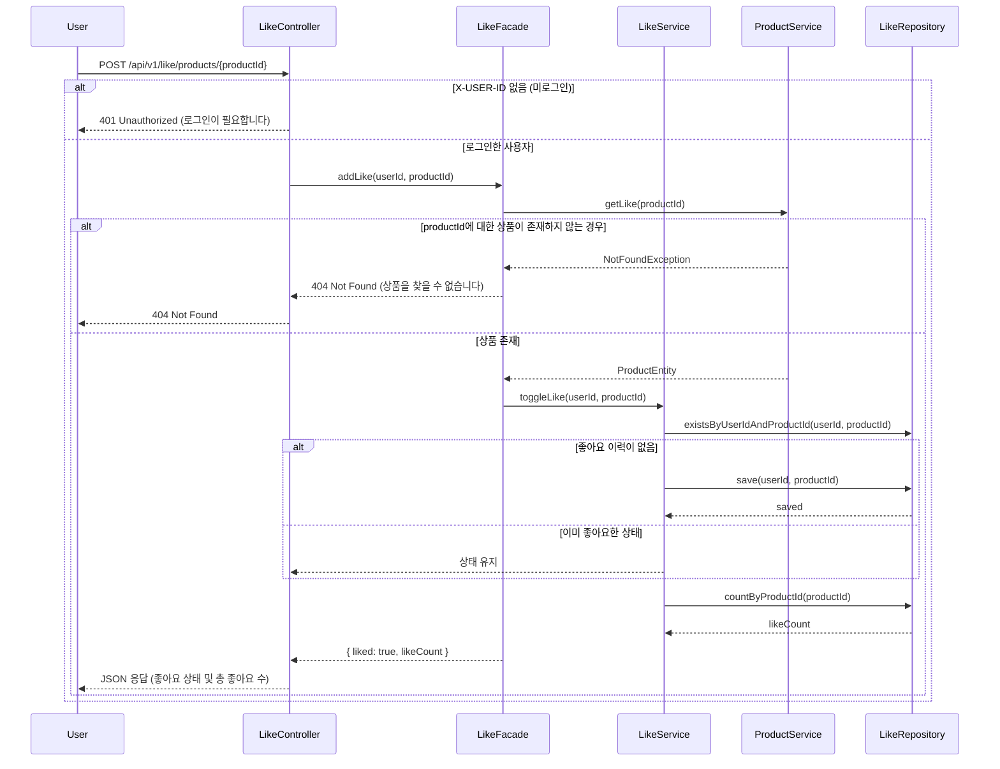
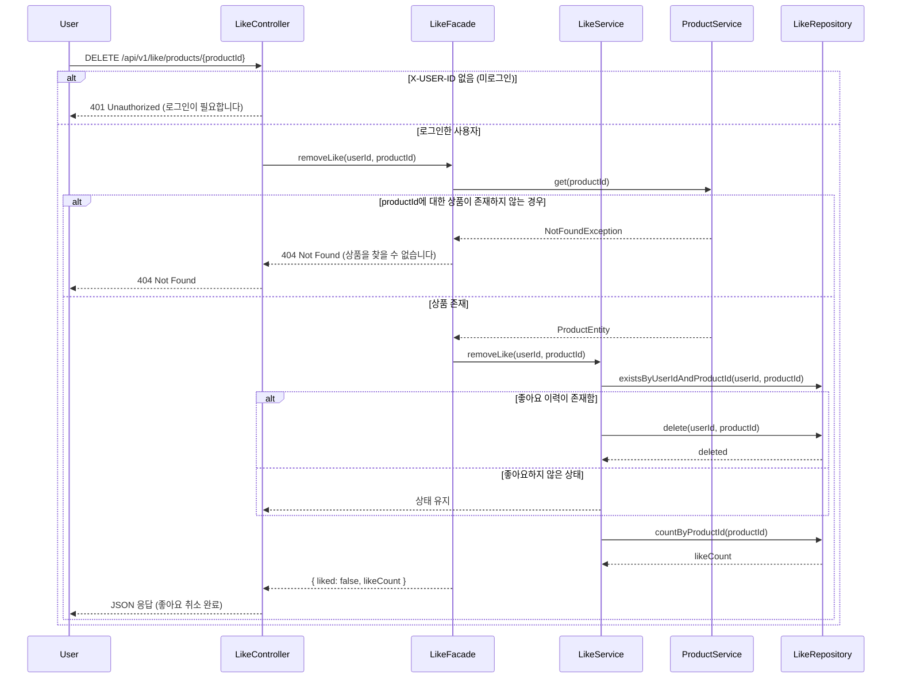
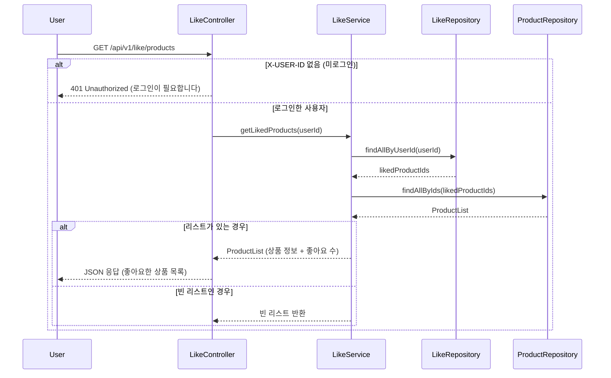
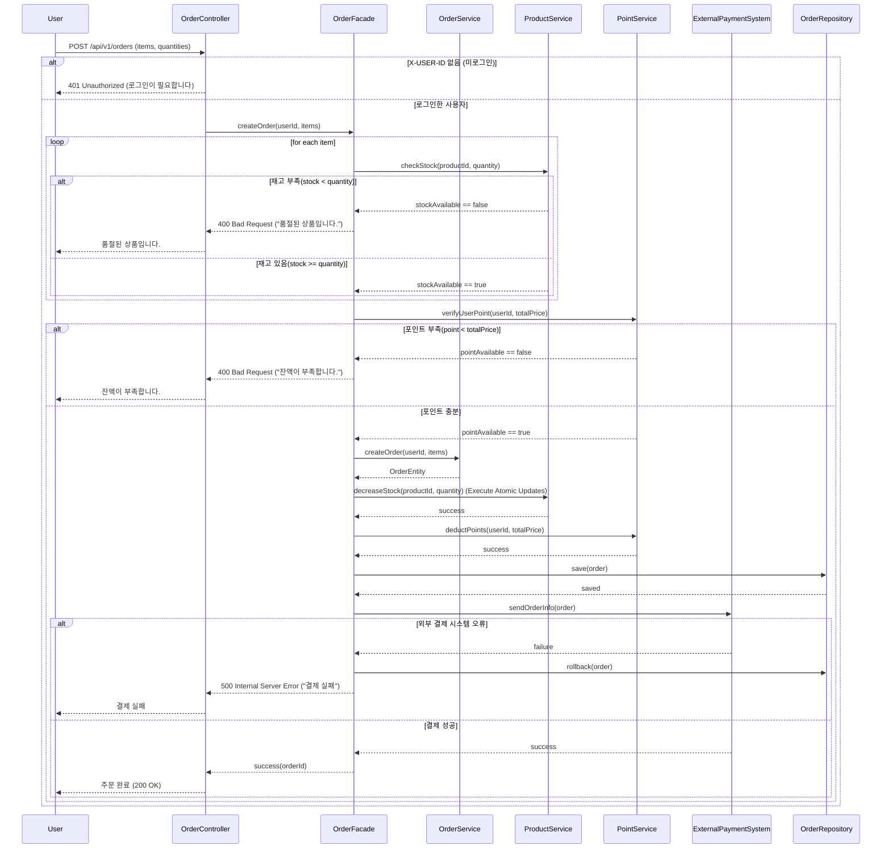
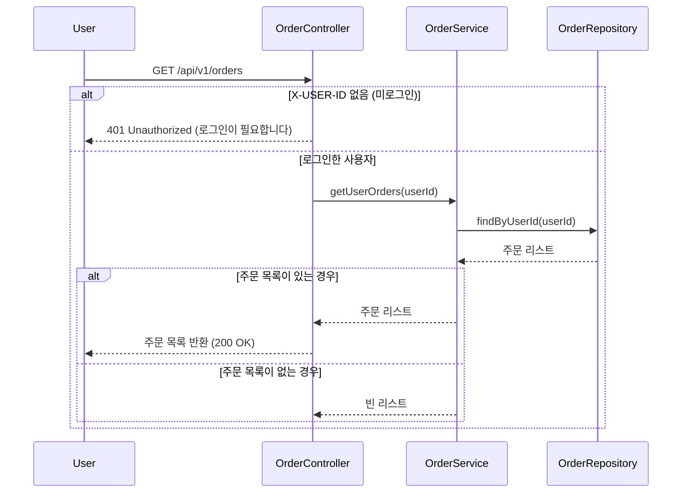
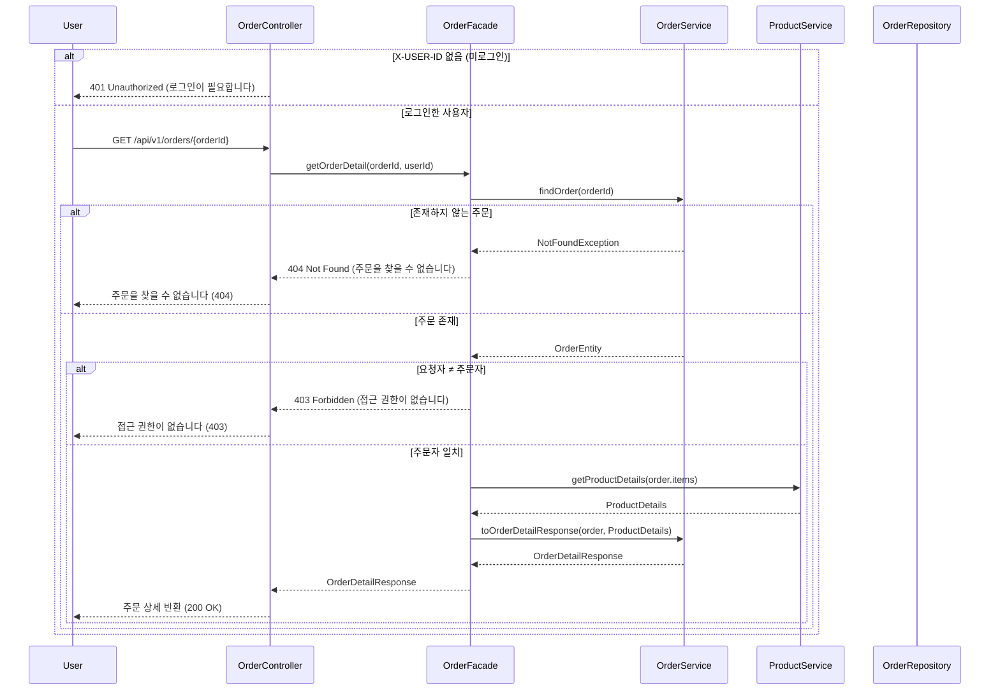

## 시퀀스 다이어그램

---
### 상품 조회

```mermaid
sequenceDiagram
    participant User
    participant ProductController
    participant ProductService
    participant ProductRepository
    participant LikeRepository

    User->>ProductController: GET /api/v1/products?sort={option}&page={n}&size=20
    ProductController->>ProductService: getProducts(userId, sortOption, page)
    ProductService->>ProductRepository: findAllOrderBy(sortOption, page)
 

    loop 상품 목록 내 각 상품
        alt 유저 아이디가 있는 경우
        ProductService->>LikeRepository: existsByUserIdAndProductId(userId, productId)
        LikeRepository-->>ProductService: isLiked (true/false)
        else 유저 아이디가 없는 경우
        LikeRepository-->>ProductService: isLiked (false), false값만 반환
        end 
        ProductService->>LikeRepository: countByProductId(productId)
        LikeRepository -->> ProductService: likeCount
    end
			
    alt 상품이 있는 경우 
    ProductService-->>ProductController: 상품 목록 + 좋아요 수 + 유저 좋아요 여부 + 다음 페이지 URL
    ProductController-->>User: 상품 목록 응답 (JSON)
    else 상품이 없는 경우
    ProductService-->>ProductController: 빈 리스트 제공
    ProductController-->>User: 상품 없음 응답 (JSON)
    end
```

---
### 상품 상세 조회

```mermaid
sequenceDiagram
    participant User
    participant ProductController
    participant ProductService
    participant ProductRepository
    participant LikeRepository

    User->>ProductController: GET /api/v1/products/{productId}
    ProductController->>ProductService: getProductDetail(userId, productId)

    ProductService->>ProductRepository: findById(productId)
    ProductRepository-->>ProductService: Product (name, price, brand, description, stock)

    ProductService->>LikeRepository: countByProductId(productId)
    LikeRepository-->>ProductService: likeCount

		alt 유저 아이디가 있는 경우
    ProductService->>LikeRepository: existsByUserIdAndProductId(userId, productId)
    LikeRepository-->>ProductService: isLiked (true/false)
    else 유저 아이디가 없는 경우
        LikeRepository-->>ProductService: isLiked (false)
        end 

    alt 상품이 존재하는 경우
        alt 재고가 0인 경우(stock == 0)
            ProductService-->>ProductController: 상품 상세 정보 + likeCount + isLiked + 품절 상태
            ProductController-->>User: 상품 상세 응답 (status="SOLD_OUT")
        else 재고가 있는 경우(stock > 0)
            ProductService-->>ProductController: 상품 상세 정보 + likeCount + isLiked
            ProductController-->>User: 상품 상세 응답 (JSON)
        end
    else 상품이 존재하지 않는 경우
        ProductService-->>ProductController: 예외 발생 
        ProductController-->>User: 404 Not Found (상품을 찾을 수 없습니다)
    end
```

---
### 브랜드 조회

```mermaid
sequenceDiagram
    participant User
    participant BrandController
    participant BrandService
    participant BrandRepository
    participant ProductRepository

    User->>BrandController: GET /api/v1/brands/{brandId}
    BrandController->>BrandService: getBrandDetail(brandId)
    BrandService->>BrandRepository: findById(brandId)

    alt 브랜드 존재
        BrandRepository-->>BrandService: 브랜드 정보(이름, 설명)
        BrandService->>ProductRepository: findByBrandId(brandId)
        ProductRepository-->>BrandService: 상품 목록
        
        alt 상품 존재
            BrandService-->>BrandController: 브랜드 정보 + 상품 목록
            BrandController-->>User: 브랜드 정보 및 상품 목록 응답 (JSON)
        else 상품 없음
            BrandService-->>BrandController: 브랜드 정보 + 빈 상품 목록
            BrandController-->>User: 브랜드 정보 + “상품이 없습니다.” 응답 (JSON)
        end
    else 브랜드 미존재
        BrandRepository-->>BrandService: null
        BrandService-->>BrandController: 예외 발생 
        BrandController-->>User: 404 Not Found (브랜드를 찾을 수 없습니다.)
    end

```

---
### 상품 좋아요

```mermaid
sequenceDiagram
    participant User
    participant LikeController
    participant LikeFacade
    participant LikeService
    participant ProductService
    participant LikeRepository

    User->>LikeController: POST /api/v1/like/products/{productId}
    
    alt X-USER-ID 없음 (미로그인)
        LikeController-->>User: 401 Unauthorized (로그인이 필요합니다)
    else 로그인한 사용자
        LikeController->>LikeFacade: addLike(userId, productId)

        LikeFacade->>ProductService: getLike(productId)
        
        alt productId에 대한 상품이 존재하지 않는 경우
            ProductService-->>LikeFacade: NotFoundException
            LikeFacade-->>LikeController: 404 Not Found (상품을 찾을 수 없습니다)
            LikeController-->>User: 404 Not Found
        else 상품 존재
            ProductService-->>LikeFacade: ProductEntity

            LikeFacade->>LikeService: toggleLike(userId, productId)
            LikeService->>LikeRepository: existsByUserIdAndProductId(userId, productId)

            alt 좋아요 이력이 없음
                LikeService->>LikeRepository: save(userId, productId)
                LikeRepository-->>LikeService: saved
            else 이미 좋아요한 상태 
                LikeService-->>LikeController: 상태 유지 
            end

            LikeService->>LikeRepository: countByProductId(productId)
            LikeRepository-->>LikeService: likeCount

            LikeFacade-->>LikeController: { liked: true, likeCount }
            LikeController-->>User: JSON 응답 (좋아요 상태 및 총 좋아요 수)
        end
    end

```

---
### 상품 좋아요 취소

```mermaid

sequenceDiagram
    participant User
    participant LikeController
    participant LikeFacade
    participant LikeService
    participant ProductService
    participant LikeRepository

    User->>LikeController: DELETE /api/v1/like/products/{productId}

    alt X-USER-ID 없음 (미로그인)
        LikeController-->>User: 401 Unauthorized (로그인이 필요합니다)
    else 로그인한 사용자
        LikeController->>LikeFacade: removeLike(userId, productId)

        LikeFacade->>ProductService: get(productId)

        alt productId에 대한 상품이 존재하지 않는 경우
            ProductService-->>LikeFacade: NotFoundException
            LikeFacade-->>LikeController: 404 Not Found (상품을 찾을 수 없습니다)
            LikeController-->>User: 404 Not Found
        else 상품 존재
            ProductService-->>LikeFacade: ProductEntity

            LikeFacade->>LikeService: removeLike(userId, productId)
            LikeService->>LikeRepository: existsByUserIdAndProductId(userId, productId)

            alt 좋아요 이력이 존재함
                LikeService->>LikeRepository: delete(userId, productId)
                LikeRepository-->>LikeService: deleted
            else 좋아요하지 않은 상태 
                LikeService-->>LikeController: 상태 유지 
            end

            LikeService->>LikeRepository: countByProductId(productId)
            LikeRepository-->>LikeService: likeCount

            LikeFacade-->>LikeController: { liked: false, likeCount }
            LikeController-->>User: JSON 응답 (좋아요 취소 완료)
        end
    end

```

---
### 내가 좋아요한 상품 목록 조회

```mermaid
sequenceDiagram
    participant User
    participant LikeController
    participant LikeService
    participant LikeRepository
    participant ProductRepository

    User->>LikeController: GET /api/v1/like/products
    alt X-USER-ID 없음 (미로그인)
        LikeController-->>User: 401 Unauthorized (로그인이 필요합니다)
    else 로그인한 사용자
    LikeController->>LikeService: getLikedProducts(userId)

    LikeService->>LikeRepository: findAllByUserId(userId)
    LikeRepository-->>LikeService: likedProductIds

    LikeService->>ProductRepository: findAllByIds(likedProductIds)
    ProductRepository-->>LikeService: ProductList
		alt 리스트가 있는 경우
    LikeService-->>LikeController: ProductList (상품 정보 + 좋아요 수)
    LikeController-->>User: JSON 응답 (좋아요한 상품 목록)
    else 빈 리스트인 경우
    LikeService-->>LikeController:빈 리스트 반환
    end
  end
```

---
### 주문 생성 및 결제 요청

```mermaid
sequenceDiagram
    participant User
    participant OrderController
    participant OrderFacade
    participant OrderService
    participant ProductService
    participant PointService
    participant ExternalPaymentSystem
    participant OrderRepository

    User ->> OrderController: POST /api/v1/orders (items, quantities)
    
    alt X-USER-ID 없음 (미로그인)
        OrderController -->> User: 401 Unauthorized (로그인이 필요합니다)
    else 로그인한 사용자
        OrderController ->> OrderFacade: createOrder(userId, items)

        loop for each item
            OrderFacade ->> ProductService: checkStock(productId, quantity)
            
            alt 재고 부족(stock < quantity)
                ProductService -->> OrderFacade: stockAvailable == false
                OrderFacade -->> OrderController: 400 Bad Request ("품절된 상품입니다.")
                OrderController -->> User: 품절된 상품입니다.
            else 재고 있음(stock >= quantity)
                ProductService -->> OrderFacade: stockAvailable == true
            end
        end

        OrderFacade ->> PointService: verifyUserPoint(userId, totalPrice)
        
        alt 포인트 부족(point < totalPrice)
            PointService -->> OrderFacade: pointAvailable == false
            OrderFacade -->> OrderController: 400 Bad Request ("잔액이 부족합니다.")
            OrderController -->> User: 잔액이 부족합니다.
        else 포인트 충분
            PointService -->> OrderFacade: pointAvailable == true

            OrderFacade ->> OrderService: createOrder(userId, items)
            OrderService -->> OrderFacade: OrderEntity
            
            %% Atomic Update 실행UPDATE product SET stock = stock - ? WHERE id = ? AND stock >= ?
            OrderFacade ->> ProductService: decreaseStock(productId, quantity) (Execute Atomic Updates)
            ProductService -->> OrderFacade: success

            OrderFacade ->> PointService: deductPoints(userId, totalPrice)
            PointService -->> OrderFacade: success

            OrderFacade ->> OrderRepository: save(order)
            OrderRepository -->> OrderFacade: saved

            OrderFacade ->> ExternalPaymentSystem: sendOrderInfo(order)
            
            alt 외부 결제 시스템 오류
                ExternalPaymentSystem -->> OrderFacade: failure
                OrderFacade ->> OrderRepository: rollback(order)
                OrderFacade -->> OrderController: 500 Internal Server Error ("결제 실패")
                OrderController -->> User: 결제 실패
            else 결제 성공
                ExternalPaymentSystem -->> OrderFacade: success
                OrderFacade -->> OrderController: success(orderId)
                OrderController -->> User: 주문 완료 (200 OK)
            end
        end
    end

```

---
### 주문 목록 조회

```mermaid
sequenceDiagram
    participant User
    participant OrderController
    participant OrderService
    participant OrderRepository

    User ->> OrderController: GET /api/v1/orders
    
    alt X-USER-ID 없음 (미로그인)
        OrderController -->> User: 401 Unauthorized (로그인이 필요합니다)
    else 로그인한 사용자
    OrderController ->> OrderService: getUserOrders(userId)
    OrderService ->> OrderRepository: findByUserId(userId)
    OrderRepository -->> OrderService: 주문 리스트 
    alt 주문 목록이 있는 경우
    OrderService -->> OrderController: 주문 리스트 
    OrderController -->> User: 주문 목록 반환 (200 OK)
    else 주문 목록이 없는 경우
    OrderService -->> OrderController: 빈 리스트
    end
	end
```

---
### 단일 주문 상세 조회

```mermaid
sequenceDiagram
    participant User
    participant OrderController
    participant OrderFacade
    participant OrderService
    participant ProductService
    participant OrderRepository

    alt X-USER-ID 없음 (미로그인)
        OrderController -->> User: 401 Unauthorized (로그인이 필요합니다)
    else 로그인한 사용자
        User ->> OrderController: GET /api/v1/orders/{orderId}
        OrderController ->> OrderFacade: getOrderDetail(orderId, userId)

        OrderFacade ->> OrderService: findOrder(orderId)
        
        alt 존재하지 않는 주문
            OrderService -->> OrderFacade: NotFoundException
            OrderFacade -->> OrderController: 404 Not Found (주문을 찾을 수 없습니다)
            OrderController -->> User: 주문을 찾을 수 없습니다 (404)
        else 주문 존재
            OrderService -->> OrderFacade: OrderEntity

            alt 요청자 ≠ 주문자
                OrderFacade -->> OrderController: 403 Forbidden (접근 권한이 없습니다)
                OrderController -->> User: 접근 권한이 없습니다 (403)
            else 주문자 일치
                OrderFacade ->> ProductService: getProductDetails(order.items)
                ProductService -->> OrderFacade: ProductDetails

                OrderFacade ->> OrderService: toOrderDetailResponse(order, ProductDetails)
                OrderService -->> OrderFacade: OrderDetailResponse

                OrderFacade -->> OrderController: OrderDetailResponse
                OrderController -->> User: 주문 상세 반환 (200 OK)
            end
        end
    end

```