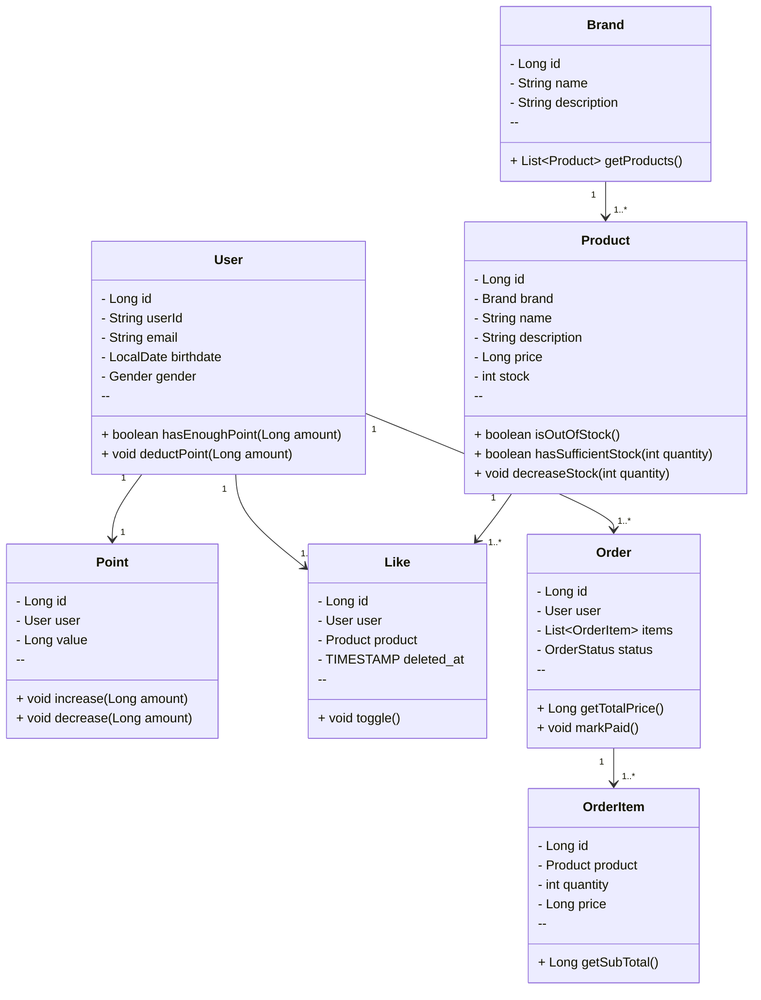

## 클래스 다이어그램

---

```mermaid
classDiagram
    class User {
        - Long id
        - String userId
        - String email
        - LocalDate birthdate
        - Gender gender
        --
        + boolean hasEnoughPoint(Long amount)
        + void deductPoint(Long amount)
    }

    class Point {
        - Long id
        - User user
        - Long value
        --
        + void increase(Long amount)
        + void decrease(Long amount)
    }

    class Product {
        - Long id
        - Brand brand
        - String name
        - String description
        - Long price
        - int stock
        --
        + boolean isOutOfStock()
        + boolean hasSufficientStock(int quantity)
        + void decreaseStock(int quantity)
    }

    class Brand {
        - Long id
        - String name
        - String description
        --
        + List~Product~ getProducts()
    }

    class Like {
        - Long id
        - User user
        - Product product
        - TIMESTAMP deleted_at
        --
        + void toggle()
    }

    class Order {
        - Long id
        - User user
        - List~OrderItem~ items
        - OrderStatus status
        --
        + Long getTotalPrice()
        + void markPaid()
    }

    class OrderItem {
        - Long id
        - Product product
        - int quantity
        - Long price
        --
        + Long getSubTotal()
    }

    User "1" --> "1..*" Order
    User "1" --> "1..*" Like
    User "1" --> "1" Point
    Order "1" --> "1..*" OrderItem
    Product "1" --> "1..*" Like
    Brand "1" --> "1..*" Product

```