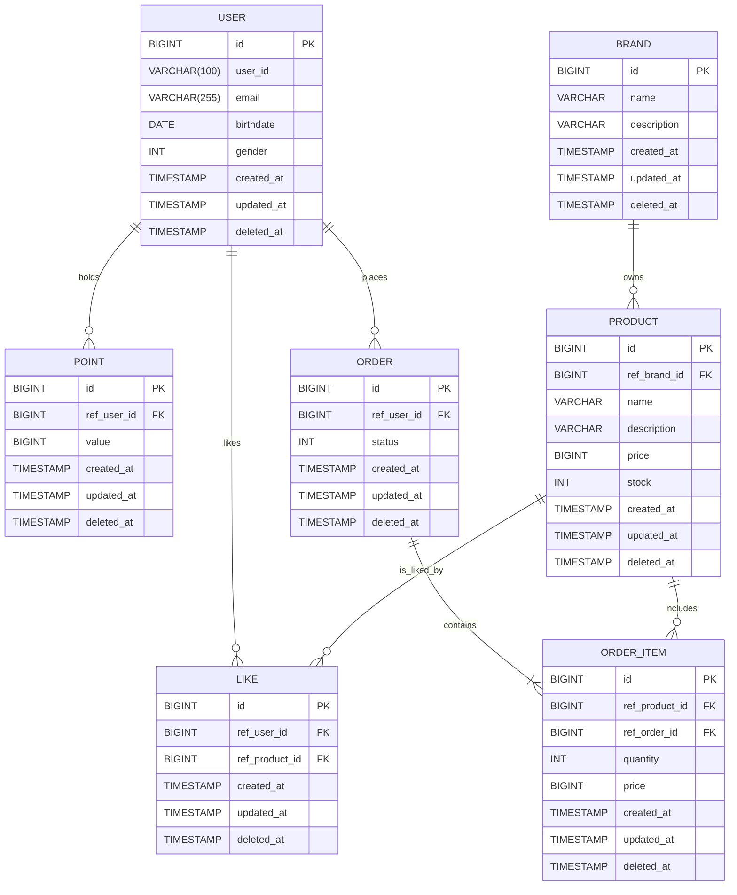

## ERD

---

```mermaid
erDiagram
    USER ||--o{ POINT : holds
    USER ||--o{ LIKE : likes
    USER ||--o{ ORDER : places

    ORDER ||--|{ ORDER_ITEM : contains
    PRODUCT ||--o{ ORDER_ITEM : includes
    BRAND ||--o{ PRODUCT : owns
    PRODUCT ||--o{ LIKE : is_liked_by

    USER {
        BIGINT id PK
        VARCHAR(100) user_id
        VARCHAR(255) email
        DATE birthdate
        INT gender
        TIMESTAMP created_at
        TIMESTAMP updated_at
        TIMESTAMP deleted_at
    }

    POINT {
        BIGINT id PK
        BIGINT ref_user_id FK
        BIGINT value
        TIMESTAMP created_at
        TIMESTAMP updated_at
        TIMESTAMP deleted_at
    }

    LIKE {
        BIGINT id PK
        BIGINT ref_user_id FK
        BIGINT ref_product_id FK
        TIMESTAMP created_at
        TIMESTAMP updated_at
        TIMESTAMP deleted_at
    }

    ORDER {
        BIGINT id PK
        BIGINT ref_user_id FK
        INT status
        TIMESTAMP created_at
        TIMESTAMP updated_at
        TIMESTAMP deleted_at
    }

    PRODUCT {
        BIGINT id PK
        BIGINT ref_brand_id FK
        VARCHAR name
        VARCHAR description
        BIGINT price
        INT stock
        TIMESTAMP created_at
        TIMESTAMP updated_at
        TIMESTAMP deleted_at
    }

    BRAND {
        BIGINT id PK
        VARCHAR name
        VARCHAR description
        TIMESTAMP created_at
        TIMESTAMP updated_at
        TIMESTAMP deleted_at
    }

    ORDER_ITEM {
        BIGINT id PK
        BIGINT ref_product_id FK
        BIGINT ref_order_id FK
        INT quantity
        BIGINT price
        TIMESTAMP created_at
        TIMESTAMP updated_at
        TIMESTAMP deleted_at
    }

```